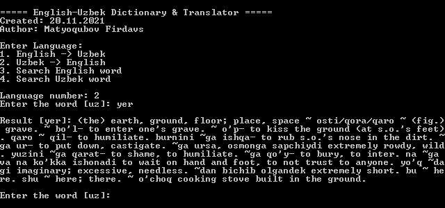

# Uzbek-English dictionary and translator. Python library

  <b>
  Bu dastur orqali ikki tildagi so'zlarni qulay tarjima qiling.
  Dastur python dasturlash tili muhitida ishlaydi va qo'shimcha kutubxona va paketlar talab qilmaydi.
  </b> 
  <h2>Ishlatish uchun qo'llanma: </h2>
    <ul>
      <li>Avvalo Repo'ni yuklab oling
      <li>Keyin <code>app.py</code> ni Python muhitida ishga tushiring
      <li>Va manabunday ishlatish mumkin
    </ul>
    <ul>
      <li>English -> Uzbek 
      <li>Uzbek -> English 
      <li>So'z qidirish 
    </ul>
  <h2>Eslatma!</h2>
    <ul>
      <li>Dasturga faqat bir bo'lakli so'z kiriting
      <li>Agar <code>o'</code> harfidan foydalansangiz — <code>`</code> belgini ishlating
    </ul>

